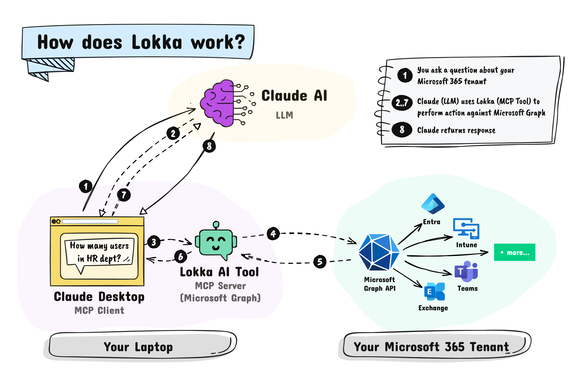

## What is Lokka?

Lokka is a simple yet powerful middleware that connects AI language models (like ChatGPT or Claude) to your Microsoft 365 tenant using Microsoft Graph.

This allows you to perform administrative tasks using natural language queries.

:::info
In technical terms, Lokka is an implementation of the [Model Context Protocol](https://modelcontextprotocol.io/introduction) (MCP) for the Microsoft Graph API.
:::

Here's a quick demo.

### Sample queries

Here are some examples of queries you can use with Lokka.

- `Create a new security group called 'Sales and HR' with a dynamic rule based on the department attribute.`
- `Find all the conditional access policies that haven't excluded the emergency access account`
- `Show me all the Intune device configuration policies assigned to the 'Call center' group`

You can ask Lokka to do anything that Microsoft Graph can do which includes support for Entra, Intune, Teams and SharePoint.

:::note
The agent will only be able to perform the actions based on the Graph permissions you grant it.
:::

## What is MCP?

[Model Context Protocol](https://modelcontextprotocol.io/introduction) (MCP) is an open protocol that enables AI models to securely interact with local and remote resources through standardized server implementations.

Lokka is an implementation of the MCP protocol for the Microsoft Graph API.

## Getting started

Want to try Lokka? It's easy to get started!

Check out the [installation guide](installation.md).